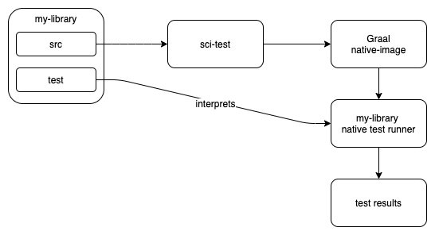

# sci-test

## Motivation

I wanted to verify that rewrite-cljc functions as expected after compiled with GraalVM native-image.
One would think that simply compiling tests with native-image would be the way to go. The reality is,
though, that Graal's `native-image` consumes more RAM than available on free tiers of popular CI services.

This is an experiment to see if I can, within the RAM constraints of CircleCI or GitHub Actions,
interpret rewrite-cljc tests over a natively compiled rewrite-cljc source (and deps).

Thanks to @borkdude for the idea.

## Overview
Here's the basic idea:



Here's how this all currently works for rewrite-cljc:


## Status

An generically named experiment that is more specific to rewrite-cljc than I'd like. I'd like to:

- perhaps discover `lib_under_sci.clj` instead of hardcoding a reference to this generated file
- perhaps generalize for testing other libs?

## Notes

Using sci to interpret rewrite-cljc tests over a natively compiled rewrite-cljc source does not 
come without issues.

### Side benefits

Whether or not I use sci to test rewrite-cljc, the exercise has other benefits:

1. found and fixed issues with rewrite-cljc coercion 
2. learned that Clojure adds positional metadata to quoted lists
3. learned a lot about sci, uncovered a couple of bugs therein and updated sci README with things I learned.
4. learned what a sci exposed rewrite-cljc might look like
5. had fun writing a ``sci_test_gen_native_image.clj` something I would have normally written in bash
6. found a bug in my internal potemkin import-macro, perhaps the flaw also exists in potemkin master

### RAM usage

I will have to revisit when RAM used during `native-image` runs increases, but without tweaks, it 
seems I will not be running this under CircleCI's available 3.5gb. I might squeak in under GitHub 
Action's 7gb. 

### Namespace tests

Some rewrite-cljc tests are dependent on ns setup. For example some tests will bind `*ns*` to a created 
ns ie `(create-ns 'test.ns)`. Sci does not support creating of ns.

Note that this is also an issue for non-bootstrap (aka non-self-hosted) cljs and these tests are currently
under review.

I have now marked these tests to be excluded for a sci test run.

### Coercion

Rewrite-cljc supports automatic coercion of Clojure forms to rewrite-cljc nodes.

#### vars
Coercion in rewrite-cljc is implemented by by extending base language types. This technique offers
no abstraction over differences in Clojure implementations. For example rewrite-cljc understands that
a vector in Clojure is a clojure.lang.IPersistentVector and in cljs it is a PersitentVector.

Sci's vars are, by design, separate from Clojure. 

A var in clj is a clojure.lang.Var, and in cljs a Var. Without changing the way rewrite-cljc coercion is
implemented, rewrite-cljc would have to somehow become aware of that in sci a var is a sci.impl.vars.SciVar. 

If there were no [substantial performance hit](https://insideclojure.org/2015/04/27/poly-perf/), I would rather
rewrite-cljc's coercion were based on interrogation fns, for example via `vector?` and `var?`.

Marked this test to be skipped by sci.

#### positional metadata on parsed elements
Sci attaches source location metadata for parsed code. For example `[1 2 3]` will, depending on its location in parsed source will have `{:line 17, :column 35, :end-line 17, :end-column 42}` metadata attached.

Clojure does something similar too but, I think, only for quoted lists:

```Clojure
Clojure 1.10.1
user=> ;; a quoted list has :line and :column metadata
user=> (meta '(1 2 3))
{:line 1, :column 8}
```

Rewrite-cljc supports coercion of Clojure sexpr and also coerces metadata. So a quoted list from Clojure will 
unexpectedly be coerced to rewrite-cljc meta node, as will all elements from edamame.

Options

1. REJECTED - change rewrite-cljc behavior to strip metadata when coercing. Coercing metadata in rewrite-cljc is 
a long standing rewrite-clj behaviour and changing it would be a breaking change. One of my primary goals for 
rewrite-cljc is to not introduce breaking changes.

2. CANDIDATE - add a new coerce method to rewrite-cljc that does not coerce attached metadata. This might be an option to consider at a later date. For now I'd like to avoid adding more functions to an already crowded API.

3. CANDIDATE - allow coerce behavior to be altered by a some binding variable. Something like Clojure `*print-meta*` but maybe `*coerce-meta*`.

4. CANDIDATE - have my usage of sci replicate Clojure metadata. But how do I know if metadata is coming from edamame
or from source it is parsing? It looks like at edamame positioning data cannot be overriden at readtime:

   ```
   > bb "(def a ^{:oink 22 :line 999} [1 2 3]) (meta a)"
   {:line 1, :column 8, :end-line 1, :end-column 37, :oink 22}
   ```

   So I could simply strip any edamame positioning metadata in my usage of sci. And then add Clojure-like metadata
   for quoted lists?:
     
   ```Clojure
   Babashka v0.1.2 REPL.
   Use :repl/quit or :repl/exit to quit the REPL.
   Clojure rocks, Bash reaches.

   user=> (meta '(1 2 3))
   {:line 6, :column 7, :end-line 6, :end-column 15}

   user=> (meta (vary-meta '(1 2 3) dissoc :end-line :end-column))
   {:line 7, :column 18}

   user=> (meta [1 2 3])
   {:line 8, :column 7, :end-line 8, :end-column 14}
   user=> (meta (with-meta [1 2 3] nil))
   ```

5. CURRENT CHOICE - same as 4 but do the stripping of metadata the API boundary so that I don't have to modify sci. Side
was re-adding `:line` metadata as a fixup step, I have forked sci to address, will figure out what is going on, and if 
appropriate will submit patch to sci.

#### metadata on records
Sci adds metadata to records this is a different behavior from Clojure and causes existing unit tests to fail.

Example metadata: `^{:sci.impl/record true, :sci.impl/type Foo-Bar}`

I have marked this test to be skipped by sci.
